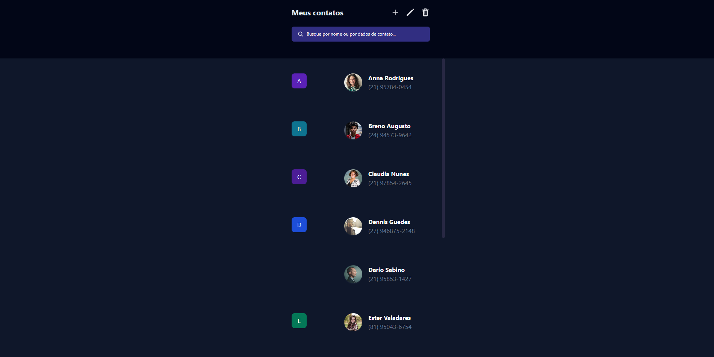

<h1 align="center"> Pagina de contatos</h1>

<a href="https://www.rocketseat.com.br/boracodar">#boraCodar</a> são desafios semanais, promovido pela Rocketseat para ensino de tecnologias WEB.  

  <a href="#-tecnologias">Tecnologias</a>&nbsp;&nbsp;&nbsp;|&nbsp;&nbsp;&nbsp;
  <a href="#-layout">Layout</a>&nbsp;&nbsp;&nbsp;|&nbsp;&nbsp;&nbsp;
  <a href="#memo-licença">Licença</a>

  

 

  

## 🚀 Tecnologias

Esse projeto foi desenvolvido com as seguintes tecnologias:

- ReactJS
- TypeScript
- Tailwind
- Git 
- GitHub

## 🔖 Layout

Você pode visualizar o layout do projeto através [DESSE LINK](https://www.figma.com/file/NPook7bQgYLIWzRnZHahcw/%23boraCodar---Desafio-16-(Community)?node-id=0-1&t=9pKHr4OIL1ALAIao-0). É necessário ter conta no [Figma](https://figma.com) para acessá-lo.

# Pagina-de-contatos
